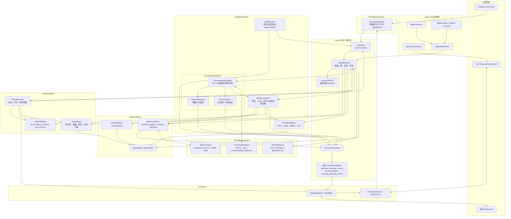
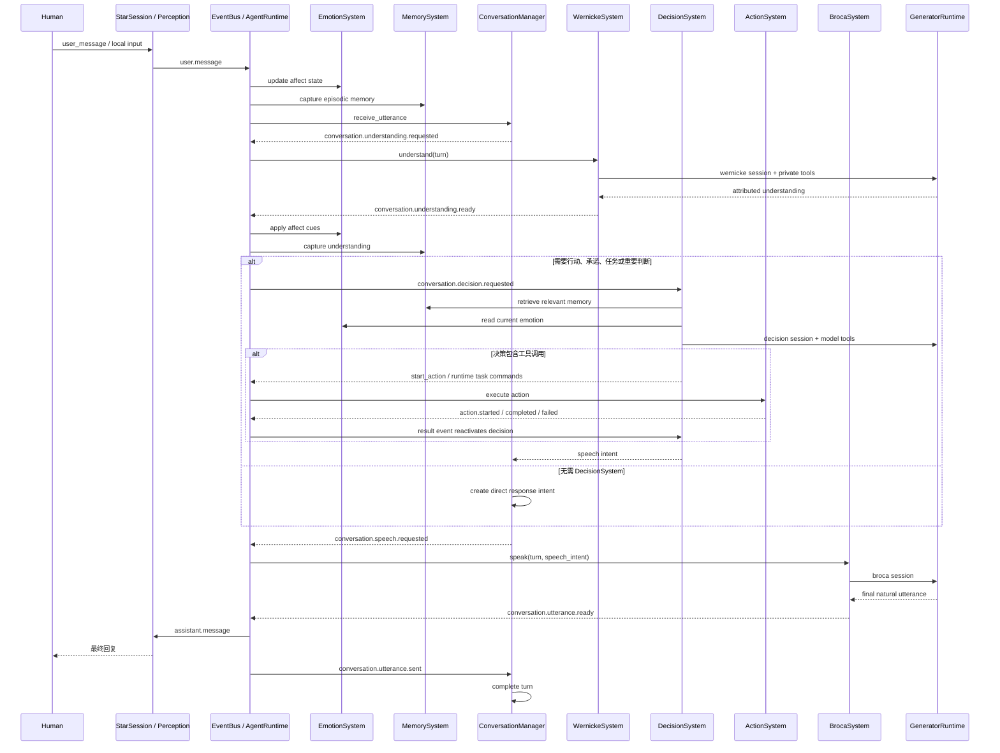
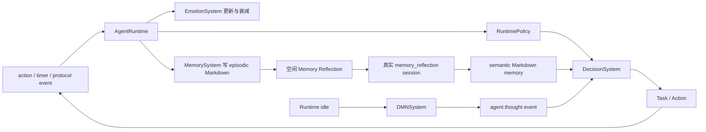

# Agent Ling 当前完整架构

本文描述当前代码已经实现并实际装配的架构。核心原则是：`AgentRuntime` 拥有事件循环和状态提交权；Conversation、Decision、Emotion、DMN 属于 CognitionSystem；Workspace 与 Memory 属于 StateSystems；模型访问统一经过 Kernel 中的 GeneratorRuntime。

## 1. 全面组件架构

ConversationSystem 位于 CognitionSystem 内部，但不拥有主循环。它负责“听懂—决定是否需要行动判断—说出最终话语”；所有阶段仍由 `AgentEvent` 经 EventBus 逐步驱动。

## 2. Conversation 完整事件链

关键边界：

- Wernicke 只理解对方，不负责采取行动或生成最终回复。
- DecisionSystem 只决定事实立场、行动、任务和表达意图；其普通文本不会直接发给用户。
- Broca 是唯一生成对外自然话语的系统。
- ConversationStore 是完整对话真相；Workspace transcript 只是近期工作材料。
- 新 turn 到达时，ConversationSystem 会抑制尚未发送的旧 turn 回复，避免陈旧回答覆盖新对话。

## 3. 非对话自主循环

这三条循环彼此协同：

1. 执行循环持续推进 Task/Action，直到完成、失败、取消或真正阻塞。
2. 记忆循环把关键事件保存为情景记忆，再低频固化为可复用经验。
3. DMN 循环在空闲时产生少量有行动价值的内部念头，重新交给 DecisionSystem 判断。

## 4. Runtime 事件路由

| 事件 | 主要处理系统 | 是否调用决策模型 |
|---|---|---|
| `user.message` | Emotion → Memory → ConversationManager | 否，先进入 Wernicke |
| `conversation.understanding.requested` | Wernicke | 调用 wernicke session |
| `conversation.understanding.ready` | Emotion → Memory → ConversationManager | 由 understanding 决定 |
| `conversation.decision.requested` | DecisionSystem | 是 |
| `conversation.speech.requested` | Broca | 调用 broca session |
| `conversation.utterance.ready` | ProtocolInterface + ConversationManager | 否 |
| `action.started` / `action.progress` | TaskSystem、Workspace | 否，避免模型风暴 |
| `action.completed` / `action.failed` | TaskSystem → Emotion → Memory → DecisionSystem | 是 |
| `runtime.continue` / `timer.fired` | DecisionSystem | 是 |
| `agent.thought` | Memory → DecisionSystem | 是 |
| `protocol.event` / `protocol.action` | Perception → RuntimePolicy → DecisionSystem | 按事件类型决定 |
| `memory.reflection.requested` | MemorySystem | 调用 memory_reflection session |
| `dmn.tick` | DMNSystem | 调用 dmn session，不直接执行工具 |

## 5. 数据所有权与持久化

| 数据 | 所有者 | 持久化位置 |
|---|---|---|
| Agent profile、Workspace、Task、ActionRun、情绪、决策历史 | `AgentState` | `{agent_id}.state.json` |
| Event 处理审计 | `AgentRuntime` | `checkpoints/{agent_id}.jsonl` |
| 模型请求、工具 schema、原始响应、context usage | `GeneratorRuntime` / Runtime | `logs/{agent_id}.generator.jsonl` |
| ConversationSession、Turn、Understanding、SpeechIntent、Utterance | `ConversationStore` | `conversations/{agent_id}.conversation.json` |
| 情景记忆与语义经验 | `MemoryStore` | `memories/{agent_id}/{episodic,semantic}/*.md` |
| 记忆检索元数据 | `MemoryStore` | `memories/{agent_id}/index.json` |

## 6. 模块边界

- `agent_ling/`：具体应用、默认 Profile/Prompt、Star 和 Console 入口。
- `agent/runtime/kernel/`：主循环、EventBus、RuntimePolicy、Generator session actor；不承载领域认知逻辑。
- `agent/runtime/cognition_system/`：Conversation、Wernicke、Broca、Decision、Emotion、DMN。
- `agent/runtime/state_systems/`：Workspace、ContextBuilder、ContextPolicy、MemorySystem。
- `agent/runtime/action_systems/`：ActionRegistry、ActionExecutor、TaskSystem。
- `agent/runtime/perception_systems/`：把本地和 Star 输入统一转成 AgentEvent。
- `agent/runtime/interfaces/`：模型与外部协议适配边界。
- `agent/runtime/persistence_system/`：状态、对话、记忆、checkpoint 与模型日志。

## 7. 当前实现边界

- EventBus 仍是单进程内存队列；状态真相已持久化，但队列本身不是持久消息系统。
- JsonStateStore 和 ConversationStore 使用原子文件替换，面向单 Runtime actor，不支持多 Worker 并发写。
- Action 支持 sync/async；stream/subscription 仍主要停留在协议事件层。
- `requires_approval` 尚未形成完整人工审批状态机。
- Memory Reflection、Decision、Wernicke、Broca、DMN 均使用真实模型接口；离线测试只验证确定性状态与边界，不伪造模型结论。
